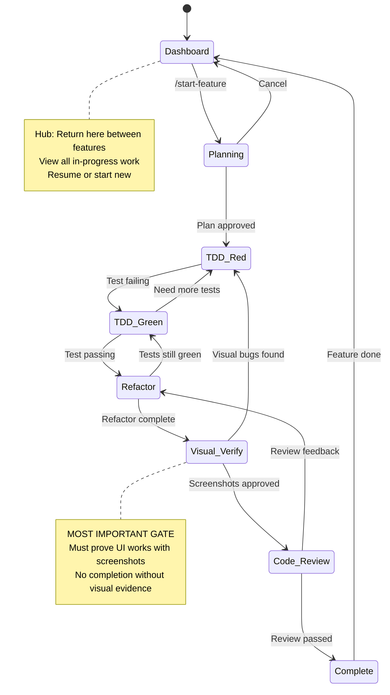

# dev-workflow

Workflow orchestration plugin for mobile and macOS development that manages the complete development lifecycle from feature planning through visual verification and release.

## Overview

**dev-workflow** is the orchestration layer that drives development processes, enforces quality gates, and maintains project context. It works as a companion to implementation plugins like **swiftui-dev**, handling workflow management while delegating platform-specific code generation.

### Core Capabilities

- **Workflow State Machine**: Explicit stage transitions (Dashboard → Planning → TDD Red → TDD Green → Refactor → Visual Verify → Review → Complete)
- **Hard Quality Gates**: TDD enforcement, accessibility validation, build verification, **visual verification**, code review
- **Context Management**: ADRs (Architecture Decision Records), architecture notes, lessons learned, session state persistence
- **Session Continuity**: Resume interrupted work, stash/restore feature state across sessions
- **Hub and Spoke Model**: Central dashboard for managing multiple in-progress features
- **Visual Verification**: Mandatory screenshot-based UI validation before feature completion (MOST IMPORTANT GATE)
- **Break Glass Override**: Emergency gate bypass with mandatory justification logging

## Philosophy

The plugin enforces a **quality-first** development process where:

1. **No code without tests** - TDD is enforced, not optional
2. **No completion without visual proof** - Screenshots must prove UI works correctly
3. **No silent failures** - All gates must explicitly pass or fail
4. **Context is preserved** - Decisions, lessons, and state persist across sessions
5. **Workflow is explicit** - Clear stages prevent getting lost in long conversations

## Installation

### Local Development

```bash
# Clone or navigate to plugin directory
cd /Users/blake/Projects/dev-workflow

# Use with Claude Code
claude --plugin-dir /Users/blake/Projects/dev-workflow
```

### Install to Claude Plugins

```bash
# Copy to Claude's plugin directory
cp -r /Users/blake/Projects/dev-workflow ~/.claude/plugins/dev-workflow

# Or symlink for development
ln -s /Users/blake/Projects/dev-workflow ~/.claude/plugins/dev-workflow
```

## Prerequisites

- **Claude Code**: Latest version (>= 2.0.0)
- **Implementation Plugin**: swiftui-dev (for iOS/macOS) or equivalent Android/Flutter plugin
- **Git**: For branch management and version control
- **Xcode** (iOS/macOS): For building and running simulators
- **iOS Simulator** or device: For visual verification

## Quick Start

### First-Time Setup

```bash
# Initialize project configuration
/init-workflow
```

This creates `.claude/dev-workflow.local.md` with project-specific settings.

### Start a New Feature

```bash
/start-feature
```

This will:
1. Prompt for feature details (name, description, acceptance criteria)
2. Create feature branch (`feat/feature-name`)
3. Initialize feature context (`.claude/context/active/feature-name.md`)
4. Enter Planning stage
5. Transition to workflow state machine

### Check Current Status

```bash
/workflow-status
```

Shows:
- Current workflow stage
- Active gates and their pass/fail status
- Recent decisions
- Next recommended actions

## Commands

### Feature Workflow

| Command | Purpose | Usage |
|---------|---------|-------|
| `/start-feature` | Begin new feature | Interactive: prompts for name, description, acceptance criteria |
| `/workflow-status` | Display workflow state | Shows current stage, gates, progress |
| `/gate-status` | Show quality gates | Pass/fail status for all gates |

### Visual Verification

| Command | Purpose | Usage |
|---------|---------|-------|
| `/verify-visual` | Run visual verification gate | Launches app, captures screenshots, validates UI |
| `/verify-visual --device "iPad Pro"` | Verify on specific device | Override default device |
| `/verify-visual --batch` | Verify all devices | Test all configured device sizes |

### Context & Documentation

| Command | Purpose | Usage |
|---------|---------|-------|
| `/record-adr` | Create Architecture Decision Record | Interactive ADR template |
| `/record-lesson` | Document lessons learned | Categorized: Process/Tech/Tooling |

### Release

| Command | Purpose | Usage |
|---------|---------|-------|
| `/prepare-release` | Run release checklist | Validates all features, checks for TODOs, etc. |

### Override (Emergency)

| Command | Purpose | Usage |
|---------|---------|-------|
| `/override gate=<gate-name> reason="<justification>"` | Break glass override | Bypasses gate with logged justification |

## Quality Gates (Hard Blocks)

All gates must pass before feature completion. Gates are checked at workflow stage transitions.

### Gate Definitions

| Gate | Enforced When | Validation | Blocking |
|------|---------------|------------|----------|
| **TDD Gate** | Before writing implementation code | Failing test must exist first | ✅ Hard block |
| **Test Pass Gate** | Before marking implementation done | All tests must pass | ✅ Hard block |
| **Accessibility Gate** | Before marking UI work done | All interactive elements have `.accessibilityIdentifier()` | ✅ Hard block |
| **Build Gate** | Before any completion | Build succeeds with zero warnings | ✅ Hard block |
| **Visual Verification Gate** | Before feature complete | App running, screenshots captured, UI visually correct | ✅ Hard block (MOST IMPORTANT) |
| **Code Review Gate** | Before final completion | Review checklist passed | ✅ Hard block |

### Visual Verification Gate (CRITICAL)

This is the **most important gate**. Feature is NOT complete until visual verification passes.

**Requirements**:
1. **Run the app** in simulator or device
2. **Navigate to feature** being implemented
3. **Capture screenshots** of all relevant states
4. **Visual inspection** - verify:
   - ✅ UI renders completely on screen (not clipped, off-screen, overlapping)
   - ✅ Layout matches requirements (no content running off edges)
   - ✅ Behavior works as expected (buttons respond, navigation works)
   - ✅ Multiple device sizes if applicable (SE, Pro, Max, iPad)
5. **Screenshot evidence** saved to `visual-proofs/feature-name/device-size/timestamp.png`

**Example Failures** (HARD BLOCK even if tests pass):
- ❌ Dashboard with scrollable content running off screen bottom
- ❌ Button partially hidden behind keyboard
- ❌ Text truncated with ellipsis when should wrap
- ❌ Navigation broken (tapping button does nothing)
- ❌ Layout broken on iPad (works on iPhone only)

### Break Glass Override

Emergency situations may require bypassing a gate. Use sparingly.

```bash
/override gate=visual-verify reason="Hotfix for P0 production crash - UI verification deferred to post-deploy validation"
```

**Override logs include**:
- Gate name
- Justification string
- Timestamp
- User
- Feature context

**Logged to**: `.claude/context/audit-log.md`

## Workflow State Machine

The plugin enforces this stage progression with explicit transitions:



### Stage Descriptions

| Stage | Purpose | Entry Criteria | Exit Criteria |
|-------|---------|----------------|---------------|
| **Dashboard** | Hub for managing work | Session start or feature completion | Select feature or start new |
| **Planning** | Feature breakdown, ADRs | `/start-feature` invoked | Plan approved, tasks defined |
| **TDD Red** | Write failing test | Plan complete | Test written and FAILS |
| **TDD Green** | Minimal implementation | Failing test exists | Test PASSES |
| **Refactor** | Clean up code | Test passing | Code cleaned, tests still green |
| **Visual Verify** | Screenshot validation | Implementation complete | Screenshots captured and approved |
| **Code Review** | Review checklist | Visual verification passed | Review completed |
| **Complete** | Feature done | All gates passed | Return to Dashboard |

### Workflow Stage Transitions

**Gentle redirection** approach:
- Plugin suggests next stage but doesn't force
- Example: "It looks like you're writing implementation code, but we haven't seen a failing test yet. Shall we create the test first?"
- User can override if they have good reason

## Hub and Spoke Dashboard

Between features, return to the Dashboard state to see all in-progress work:

```
╔════════════════════════════════════════════════════════════╗
║              Development Workflow Dashboard                ║
╠════════════════════════════════════════════════════════════╣
║                                                            ║
║  Active Features:                                          ║
║                                                            ║
║  1. Login Screen                [Visual Verify] 🟡         ║
║     Branch: feat/login-screen                              ║
║     Gates: ✅ TDD ✅ Build ⏳ Visual ⏳ Review               ║
║     Last: 2 hours ago                                      ║
║                                                            ║
║  2. Dashboard Refactor          [TDD Green] 🟢             ║
║     Branch: feat/dashboard                                 ║
║     Gates: ✅ TDD ⏳ Build ⏳ Visual ⏳ Review               ║
║     Last: 5 hours ago                                      ║
║                                                            ║
║  Stale Work:                                               ║
║                                                            ║
║  3. Settings Screen             [Suspended: 12 days] ⚠️    ║
║     Branch: feat/settings                                  ║
║     Suggest: Archive or resume?                            ║
║                                                            ║
╠════════════════════════════════════════════════════════════╣
║  Actions:                                                  ║
║  - /start-feature (new)                                    ║
║  - Type number to resume (e.g., "1" to resume login)       ║
║  - /prepare-release (when all complete)                    ║
╚════════════════════════════════════════════════════════════╝
```

**Dashboard displays**:
- All active features with current stage
- Gate status for each feature
- Time since last work on each feature
- Stale work warnings (>7 days)
- Available actions

## Context Management

### Architecture Decision Records (ADRs)

ADRs use the **Michael Nygard format**:

```markdown
# ADR-001: Use SwiftData Instead of CoreData

## Status
Accepted

## Context
We need to persist user data locally. CoreData has been the standard,
but SwiftData is the modern replacement introduced in iOS 17.

Our app targets iOS 18+, so we can use SwiftData.

## Decision
Use SwiftData for all data persistence needs in this application.

## Consequences

### Positive
- Simpler API using Swift macros (@Model, @Query)
- Better Swift 6 concurrency support with @MainActor
- Automatic CloudKit sync with minimal configuration
- Type-safe relationships and queries

### Negative
- Requires iOS 17+ minimum deployment target
- Fewer online resources compared to mature CoreData
- Migration tools less mature than CoreData
- Some advanced CoreData features not yet available
```

**Storage**: `docs/adr/NNNN-title.md`

**When to create**:
- Choosing between architectural approaches
- Major technology decisions (SwiftData vs CoreData)
- Pattern selections (MVVM vs MV)
- Integration strategies (CloudKit vs custom backend)

### Lessons Learned

**Categories**:
- **Process**: Workflow improvements, team communication, planning issues
- **Tech**: Framework limitations, language gotchas, API surprises
- **Tooling**: IDE problems, build issues, dependency conflicts

**Format**:
```markdown
## 2026-01-19: SwiftUI Preview Memory Leak

**Category**: Tooling
**Impact**: High
**Tags**: xcode, swiftui, memory

### Problem
Xcode SwiftUI previews consuming 12GB RAM after 2 hours of development.
Preview canvas becomes unresponsive, forcing Xcode restart.

### Solution
Restart Xcode every hour during heavy preview work.
Close preview canvas when not actively using it.

### Prevention
- Monitor Activity Monitor during preview-heavy sessions
- Use live app in simulator for complex UI testing
- Consider disabling automatic preview refresh

### Related
- ADR-003: Why we use simulators over previews for complex views
```

**Storage**: `.claude/context/lessons/YYYY-MM-DD-title.md`

### Architecture Notes

Architectural diagrams, component relationships, technical constraints.

**Storage**: `.claude/context/architecture/`

**Examples**:
- System architecture diagrams (Mermaid)
- Component interaction patterns
- Data flow documentation
- API integration patterns
- Security architecture

### Feature State

Active features tracked in `.claude/context/active/feature-name.md`:

```markdown
# Feature: Login Screen

**Branch**: feat/login-screen
**Started**: 2026-01-19 09:00
**Current Stage**: Visual Verify

## Workflow Progress

- ✅ Planning - Complete
- ✅ TDD Red - LoginViewTests.swift created, failing
- ✅ TDD Green - LoginView implementation passing all tests
- ✅ Refactor - Extracted AuthService
- 🔄 Visual Verify - In progress
- ⏳ Code Review - Not started

## Quality Gates

- ✅ TDD Gate - Tests exist and passed
- ✅ Accessibility Gate - All elements have IDs
- ✅ Build Gate - Zero warnings
- ⏳ Visual Verification Gate - Pending
- ⏳ Code Review Gate - Pending

## Recent Decisions

- Use @Observable instead of ObservableObject for AuthService
- Store auth token in Keychain (ADR-007)

## Screenshots

Pending visual verification.

## Next Steps

1. Run app in simulator
2. Capture screenshots of login flow
3. Verify layout on SE, Pro, iPad
4. Validate keyboard handling
```

## Session Continuity

### Session Start

On each Claude Code session start, the plugin loads context and displays summary:

```
╔════════════════════════════════════════════════════════════╗
║            Welcome Back - Session Restored                 ║
╠════════════════════════════════════════════════════════════╣
║                                                            ║
║  Last Active: Login Screen feature                         ║
║  Current Stage: Visual Verify                              ║
║  Branch: feat/login-screen                                 ║
║                                                            ║
║  Workflow Progress:                                        ║
║    ✅ Planning → ✅ TDD Red → ✅ TDD Green → ✅ Refactor    ║
║    🔄 Visual Verify (current)                              ║
║                                                            ║
║  Last Action: Updated AuthService to use async/await       ║
║                                                            ║
║  Pending Gates:                                            ║
║    ✅ TDD - Tests passing                                  ║
║    ✅ Accessibility - All IDs present                      ║
║    ✅ Build - No warnings                                  ║
║    ⏳ Visual Verification - Not started                    ║
║    ⏳ Code Review - Not started                            ║
║                                                            ║
║  Ready to continue with visual verification?               ║
║                                                            ║
╚════════════════════════════════════════════════════════════╝
```

**State loaded**:
- Current feature being worked on
- Current workflow stage
- Gate pass/fail status
- Recent decisions (last 3)
- Next recommended action

### Stash and Resume

If you switch to a different task mid-feature:

**Automatic stashing**:
1. Plugin detects context switch (new `/start-feature` while one active)
2. Serializes current state to `.session/suspended-feature-name.json`
3. Clears active context for clean slate
4. New feature becomes active

**Manual stashing**:
```bash
/stash "Need to fix urgent bug"
```

**Resume**:
```bash
/resume login-screen
```

Or select from Dashboard.

### Stale Work Detection

If feature branch hasn't been touched in >7 days:

```
⚠️  Stale Work Detected

You have a stale branch: feat/settings-screen
Last commit: 9 days ago
Last workflow activity: 12 days ago

Current stage: TDD Red (incomplete)

Options:
1. Resume work (restore full context)
2. Archive (create archive branch, close context)
3. Delete (abandon work, close context)

What would you like to do?
```

**Stale threshold**: Configurable in `.claude/dev-workflow.local.md` (default: 7 days)

## Configuration

### Project Settings

Create `.claude/dev-workflow.local.md`:

```markdown
# dev-workflow Configuration

## Implementation Plugin
preferred_plugin: swiftui-dev

## Screenshot Storage
screenshot_path: visual-proofs/
screenshot_device_default: iPhone 15 Pro

## Gate Configuration
gates:
  tdd_strict: true
  visual_verification_required: true
  visual_verification_devices:
    - iPhone SE (3rd generation)
    - iPhone 15 Pro
    - iPad Pro (12.9-inch) (6th generation)
  accessibility_required: true
  build_warnings_allowed: 0

## Context Storage
adr_path: docs/adr/
lessons_path: .claude/context/lessons/
architecture_notes_path: .claude/context/architecture/
context_path: .claude/context/

## Workflow Preferences
auto_create_branch: true
auto_summarize_on_session_start: true
check_stale_work_days: 7
hub_dashboard_on_start: true

## Audit
audit_log_path: .claude/context/audit-log.md
log_overrides: true
```

### Device Size Classes

Instead of hardcoding device models, define **size classes**:

```markdown
## Device Size Classes

size_classes:
  compact:
    name: iPhone SE (3rd generation)
    description: Smallest supported screen
  standard:
    name: iPhone 15 Pro
    description: Standard modern iPhone
  max:
    name: iPhone 15 Pro Max
    description: Largest iPhone
  tablet:
    name: iPad Pro (12.9-inch) (6th generation)
    description: Tablet size
```

Visual verification will test all defined size classes.

## Integration with swiftui-dev

**dev-workflow** orchestrates the process, **swiftui-dev** handles implementation:

### Delegation Flow

```
User Request: "Add login screen"
         │
         ▼
┌────────────────────────────────────────────────┐
│  dev-workflow: workflow-orchestrator agent     │
│  1. Detect feature request (UserPromptSubmit)  │
│  2. Invoke /start-feature workflow             │
│  3. Create feature context                     │
│  4. Enter Planning stage                       │
└────────────────────────────────────────────────┘
         │
         ▼
┌────────────────────────────────────────────────┐
│  Delegate to swiftui-dev for design            │
│  Command: /swiftui:design                      │
│  → swiftui-ux-designer agent creates UI spec   │
└────────────────────────────────────────────────┘
         │
         ▼
┌────────────────────────────────────────────────┐
│  Delegate to swiftui-dev for implementation    │
│  Command: /swiftui:plan                        │
│  → project-architect creates breakdown         │
└────────────────────────────────────────────────┘
         │
         ▼
┌────────────────────────────────────────────────┐
│  dev-workflow: Transition to TDD Red           │
│  Hook: PreToolUse enforces failing test first  │
└────────────────────────────────────────────────┘
         │
         ▼
┌────────────────────────────────────────────────┐
│  Delegate to swiftui-dev for code generation   │
│  Agent: mobile-code-implementer                │
│  → Generates SwiftUI views with accessibility  │
└────────────────────────────────────────────────┘
         │
         ▼
┌────────────────────────────────────────────────┐
│  dev-workflow: Transition to Visual Verify     │
│  Command: /verify-visual                       │
│  → Uses /swiftui:screenshot for captures       │
│  → Adds validation layer on top                │
└────────────────────────────────────────────────┘
         │
         ▼
┌────────────────────────────────────────────────┐
│  dev-workflow: Transition to Code Review       │
│  Agent: gate-enforcer validates all gates      │
│  → Delegates to swiftui-dev /audit if needed   │
└────────────────────────────────────────────────┘
         │
         ▼
┌────────────────────────────────────────────────┐
│  dev-workflow: Complete                        │
│  Return to Dashboard                           │
└────────────────────────────────────────────────┘
```

### Interface Methods

**Command invocation**:
```
/swiftui:design     # UI/UX design
/swiftui:plan       # Implementation planning
/swiftui:build      # xcodebuild
/swiftui:test       # Run tests
/swiftui:screenshot # Capture screenshots
/swiftui:audit      # Code quality audit
```

**Agent deployment**:
```
Deploy: swiftui-ux-designer
Deploy: mobile-code-implementer
Deploy: architect-review
```

**Script access**:
```bash
# Reference swiftui-dev scripts
$SWIFTUI_DEV_ROOT/skills/ios-simulator/scripts/screenshot.py
```

## Hooks

Hooks enforce workflow automatically without user intervention:

### SessionStart Hook

**Trigger**: Claude Code session starts

**Actions**:
1. Load `.claude/context/active/*.md` files
2. Check for stale work (>7 days)
3. Display Dashboard or restore last active feature
4. Show summary of pending gates

**Output**:
```
Session restored. Active feature: Login Screen
Current stage: Visual Verify
Pending gates: Visual Verification, Code Review
```

### PreToolUse Hook

**Trigger**: Write or Edit operations on `.swift` files

**TDD Enforcement**:
1. Check if file is a test file (`*Tests.swift`)
   - If yes: Allow (writing tests is always allowed)
2. Check if file is implementation
   - Look for recent test file changes/additions
   - Look for failing test run output in context
   - If no failing test found: **BLOCK**

**Blocking message**:
```
🛑 TDD Guard

You are attempting to write implementation code, but I don't see a failing
test for this requirement yet.

TDD Workflow:
1. Write a test that FAILS (Red)
2. Write minimal code to make it PASS (Green)
3. Refactor while staying Green

Please create a test case that fails first, then implement the code.
```

**Allow writing tests**: Test files are never blocked

### Stop Hook

**Trigger**: Claude Code session ends

**Actions**:
1. Save current workflow state to `.session/state.json`
2. Record session summary
3. Prompt for lessons learned (if applicable)

**Prompt**:
```
Session ending. Would you like to record any lessons learned from this session?

Common categories:
- Process: Workflow or planning insights
- Tech: Framework/language gotchas discovered
- Tooling: IDE, build, or dependency issues encountered

/record-lesson [title]  or  Skip
```

### UserPromptSubmit Hook

**Trigger**: User submits a prompt

**Intent Classification**:

Uses LLM to classify user intent:
- **Feature request**: "add login", "implement dashboard"
- **Bug fix**: "fix crash", "login button not working"
- **Refactoring**: "refactor", "clean up", "extract"
- **Other**: General questions, research

**Actions by intent**:

| Intent | Action |
|--------|--------|
| Feature | Activate workflow-orchestrator, suggest `/start-feature` |
| Bug | Activate workflow-orchestrator, create failing test for bug reproduction |
| Refactor | Verify currently in "Green" state, then allow refactor |
| Other | No workflow activation |

**Example**:
```
User: "Add a logout button to settings"

Hook detects: Feature request
→ "I detected a feature request. Would you like to start a new feature workflow? /start-feature"
```

## Agents

### workflow-orchestrator (Main Conductor)

**Color**: Blue
**Tools**: All
**Model**: Sonnet

**When to deploy**: Any development task (features, bugs, refactoring)

**Responsibilities**:
- Sequence workflow stages
- Coordinate with implementation plugins (swiftui-dev)
- Manage context across stages
- Proactively suggest next steps
- Enforce stage transitions

**Triggering**:
- Automatically via UserPromptSubmit hook
- Manually when starting complex work

**Example invocation**:
```
User: "Let's build the settings screen"

workflow-orchestrator activates:
1. Suggests /start-feature
2. Guides through Planning stage
3. Coordinates with swiftui-dev for design/planning
4. Enforces TDD Red → Green → Refactor
5. Ensures visual verification
6. Completes with all gates passed
```

**Handoff to swiftui-dev**:
- Treats swiftui-dev as sub-contractor
- Delegates specific tasks ("Generate LoginView code")
- Waits for completion
- Validates output against gates

**Aggressiveness**: Gentle reminders, not hard redirects

### gate-enforcer (Quality Guardian)

**Color**: Red
**Tools**: Read, Grep, Glob, Bash (read-only verification)
**Model**: Sonnet

**When to deploy**: Workflow stage transitions, before marking work complete

**Responsibilities**:
- Validate all quality gates
- Check TDD compliance (test exists and passes)
- Verify accessibility identifiers present
- Confirm build succeeds with zero warnings
- **Validate visual verification** (screenshots + visual correctness)
- Block progression on gate failures

**Visual verification validation**:
- **Hybrid approach**: AI pre-flight + human confirmation
- AI checks:
  - Screenshot files exist at expected paths
  - Resolution appropriate for device
  - Basic layout analysis (elements on-screen, not clipped)
  - Contrast/readability warnings
- Human confirmation:
  - "I've analyzed the screenshots. The layout appears correct on all devices. Please confirm the UI behaves as expected."
  - User must explicitly approve

**Gate history**:
- Logs all gate checks to `audit-log.md`
- Records: timestamp, gate, status, feature, user

**Example output**:
```
╔════════════════════════════════════════╗
║       Quality Gate Status              ║
╠════════════════════════════════════════╣
║                                        ║
║  ✅ TDD Gate                           ║
║     Tests exist: LoginViewTests.swift  ║
║     Status: 5 passing                  ║
║                                        ║
║  ✅ Accessibility Gate                 ║
║     All elements have IDs              ║
║     Verified: 8 interactive elements   ║
║                                        ║
║  ✅ Build Gate                         ║
║     Build: Success                     ║
║     Warnings: 0                        ║
║                                        ║
║  ❌ Visual Verification Gate           ║
║     Screenshots: Not found             ║
║     Required: SE, Pro, iPad            ║
║     BLOCKING: Run /verify-visual       ║
║                                        ║
║  ⏳ Code Review Gate                   ║
║     Status: Not started                ║
║                                        ║
╠════════════════════════════════════════╣
║  Cannot proceed to completion          ║
║  1 gate failing: Visual Verification   ║
╚════════════════════════════════════════╝
```

### context-curator (Context Manager)

**Color**: Green
**Tools**: Read, Write, Edit, Grep, Glob
**Model**: Haiku (efficient for context management)

**When to deploy**: ADR creation, lessons learned, architecture notes, context queries

**Responsibilities**:
- Create and manage ADRs (Michael Nygard format)
- Record lessons learned with categorization
- Maintain architecture notes
- Organize and archive closed feature contexts
- Proactively suggest ADR creation when architectural decisions detected

**Proactive triggers**:
- User mentions "decided to use X instead of Y" → Suggest ADR
- Major technology choice discussed → Suggest ADR
- End of session → Prompt for lessons learned

**Example interaction**:
```
User: "We decided to swap CoreData for SwiftData because of better concurrency support"

context-curator: "That sounds like a major architectural decision. Should I draft an ADR for that?"

User: "Yes"

context-curator creates docs/adr/0007-use-swiftdata-over-coredata.md with template pre-filled
```

**Token budget awareness**:
- Keeps ADRs concise (150-250 tokens)
- Archives closed feature contexts
- Maintains index files for quick reference

## Troubleshooting

### "TDD Gate blocking me but I have a test"

**Possible causes**:
1. Test file not recently created/modified (check git status)
2. Test hasn't been run yet (need to see failing output)
3. Test file doesn't follow naming convention (`*Tests.swift`)
4. Test is in different module/target

**Solutions**:
- Run the test to show it fails: `/swiftui:test`
- Verify test file is staged/committed recently
- Check test file naming matches pattern

### "Visual verification failing but UI looks correct to me"

**Possible causes**:
1. Screenshots not captured at correct paths
2. Missing device sizes (configured in .local.md)
3. Screenshot filename format incorrect
4. AI vision analysis overly sensitive

**Solutions**:
- Verify screenshot paths: `visual-proofs/feature-name/device/timestamp.png`
- Check all required device sizes present
- Review AI analysis warnings (may be false positives)
- Explicitly confirm: "The UI is correct, approve visual gate"

### "Context not restoring on session start"

**Possible causes**:
1. `.claude/context/` directory doesn't exist
2. `.claude/dev-workflow.local.md` missing
3. Session state files corrupted (invalid JSON)
4. File permissions issue

**Solutions**:
- Run `/init-workflow` to create config
- Verify `.session/state.json` exists and is valid JSON
- Check file permissions: `ls -la .claude/context/`
- Delete `.session/` and start fresh if corrupted

### "Hook not triggering"

**Possible causes**:
1. Hook configuration syntax error in `hooks/hooks.json`
2. Hook script not executable
3. Timeout too short
4. Path to script incorrect

**Solutions**:
- Validate `hooks/hooks.json` syntax
- Check script permissions: `chmod +x hooks/scripts/script.sh`
- Run Claude Code with `--debug` to see hook execution
- Verify paths use `$CLAUDE_PLUGIN_ROOT`

### "Workflow stage stuck"

**Possible causes**:
1. Stage transition condition not met
2. Gate blocking progression
3. State file not updated

**Solutions**:
- Check `/gate-status` to see blocking gates
- Verify completion criteria for current stage
- Manually update state if necessary: `/workflow-status --reset`

## Best Practices

### TDD Discipline

**Red → Green → Refactor**:
1. Write test that **FAILS** (Red)
2. Verify the failure with test run output
3. Write **minimal** code to make it pass (Green)
4. Verify test now **PASSES**
5. Refactor while staying green
6. Run tests again to ensure still green

**Common mistakes**:
- ❌ Writing implementation before test
- ❌ Writing test that passes immediately (not a real test)
- ❌ Skipping the "see it fail" step
- ❌ Writing too much implementation at once

### Visual Verification Checklist

Before `/verify-visual`:

- [ ] App builds successfully
- [ ] Feature is accessible in running app
- [ ] All required simulators available
- [ ] Test all user flows (happy path + edge cases)

During `/verify-visual`:

- [ ] App launches successfully
- [ ] Navigate to all feature screens
- [ ] Capture screenshots of each state
- [ ] Test all interactive elements
- [ ] Verify layout on all device sizes
- [ ] Check both portrait and landscape (if applicable)
- [ ] Test keyboard handling (if applicable)

After `/verify-visual`:

- [ ] Review all screenshots for correctness
- [ ] Verify no clipping or off-screen content
- [ ] Confirm behavior matches requirements
- [ ] Screenshots saved to correct paths

### ADR Decision Criteria

**Create an ADR when**:
- ✅ Choosing between multiple architectural approaches
- ✅ Selecting core technologies (persistence, networking)
- ✅ Defining patterns (MVVM, MV, etc.)
- ✅ Making decisions with long-term consequences
- ✅ Trade-offs that future developers need to understand

**Don't create ADR for**:
- ❌ Trivial implementation details
- ❌ Decisions easily reversed
- ❌ Standard practices (using SwiftUI for SwiftUI app)
- ❌ Temporary workarounds

### Lessons Learned Guidelines

**Good lessons**:
- ✅ Specific problem with context
- ✅ Solution that worked
- ✅ Prevention strategy
- ✅ Categorized properly (Process/Tech/Tooling)
- ✅ Searchable tags

**Poor lessons**:
- ❌ Too vague ("had problems")
- ❌ No solution provided
- ❌ Blaming without learning
- ❌ Missing context

## License

MIT

## Author

Blake Crane (jbcrane13@github.com)

## Contributing

Contributions welcome! This plugin is designed to orchestrate development workflows and integrate with implementation plugins.

If building a complementary implementation plugin (android-dev, flutter-dev, etc.):

**Required interface**:
- Commands for: design, build, test, screenshot capture
- Agents for: code implementation, architecture review
- Accessibility ID conventions for test automation
- Build validation and error reporting

**dev-workflow will**:
- Orchestrate workflow stages for your platform
- Enforce quality gates
- Manage context and decisions
- Call your implementation plugin when code is needed
